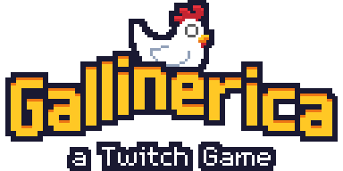
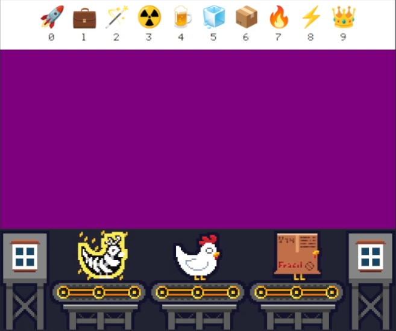
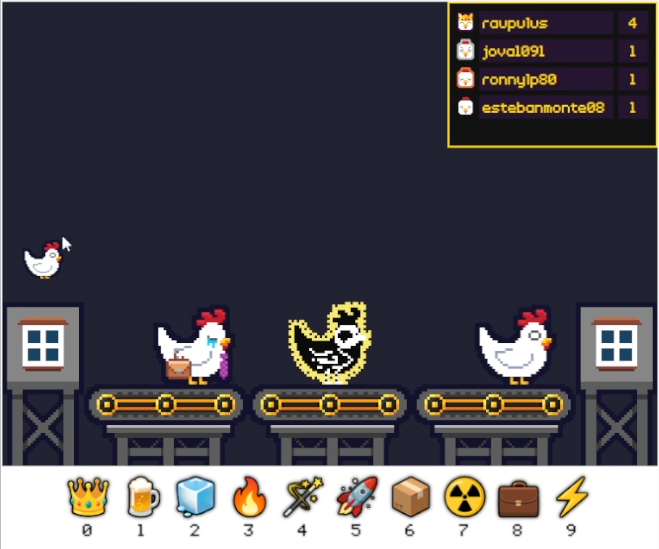
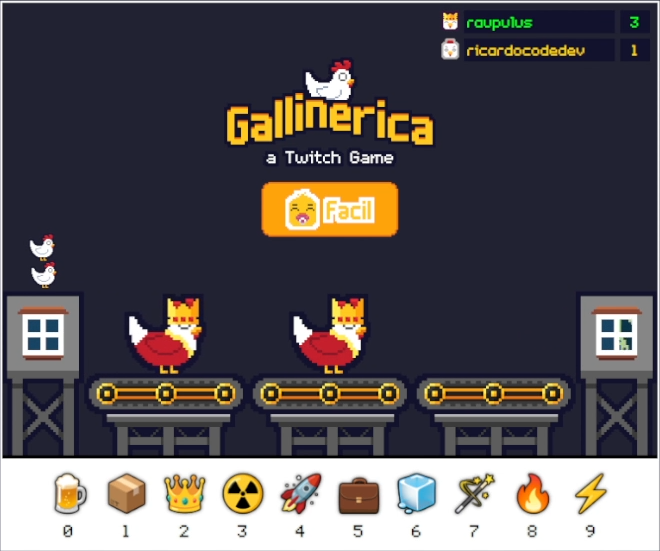
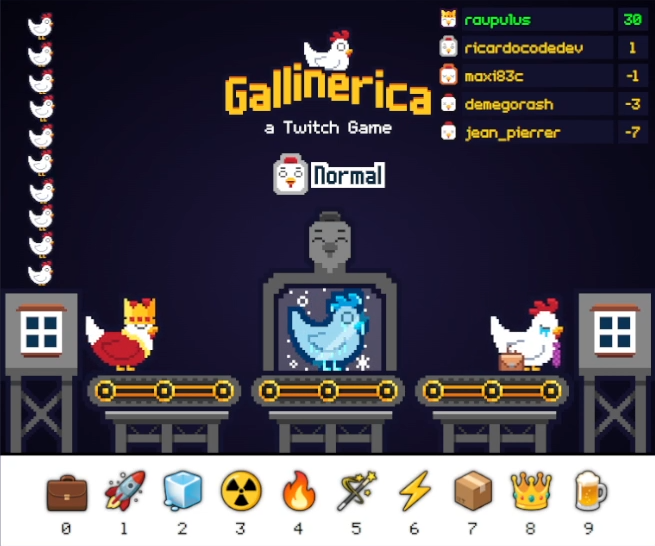

## ¿Qué es Gallinérica?

Gallinérica es un juego para Twitch, donde los streamers podrán colocar su canal y permitir que los espectadores jueguen. En este documento se habla más de la parte técnica, orientada para desarrolladores.

> Si quieres saber más sobre el juego (como jugador), visita la página de [Gallinérica en Itch.io](https://manzdev.itch.io/gallinerica).

## ¿Con qué está desarrollado Gallinérica?

Gallinérica no está desarrollado con ningún motor de videojuegos ni framework. Si te interesa alguno te recomendaría [Phaser](https://phaser.io/) o [Godot](https://godotengine.org/). Se realizó como reto en Javascript vanilla, utilizando exclusivamente HTML, CSS y Javascript. Para aislar las funcionalidades, utilizamos WebComponents, que es una tecnología Javascript nativa.

Esta desarrollado por [Manz](https://links.manz.dev/), gráficos diseñados por [BlurSoul_](https://twitter.com/blursoul_) y ayuda de maxi83c en diseño y código.

Tienes más información aquí:

- HTML: https://lenguajehtml.com/html/
- CSS: https://lenguajecss.com/css/
- Javascript: https://lenguajejs.com/javascript/
- WebComponents: https://lenguajejs.com/webcomponents/


## ¿Dónde fue desarrollado Gallinérica?

Gallinérica es un juego que participa en la [JAM de Numérica](https://itch.io/jam/numerica-twitch-jam) de @RothioTome, donde hay que realizar un juego para Twitch similar a [Numérica](https://rothiotome.itch.io/numerica).

El juego se desarrolló durante 4 streams de Twitch, que de momento, puedes ver en mi canal de Youtube:

### Día 1: Base del juego

- Layout principal del juego (CSS)
- Mecanismo de cintas transportadoras (Javascript)
- Pollos moviendose en las cintas (Javascript/CSS)
- Mecanismo de comunicación con Twitch (Javascript)



- Youtube: https://youtu.be/B7NIXdiA35g

### Día 2: Mecánica principal

- Implementación de tipos de pollos (CSS)
- Mecanismo de comunicación con Twitch (Javascript)
- Tabla de líderes del juego (Javascript)



- Youtube: https://youtu.be/CabQJ3sYkMQ

### Día 3: Perfeccionamiento del juego

- Niveles de dificultad (Javascript)
- Rachas de pollos seguidos (Javascript/CSS)



- Youtube: https://youtu.be/k6i65SCt838

### Día 4: Corrección de problemas y últimos detalles

- Atardecer y amanecer: fondos mejorados (CSS/Javascript)
- Estadísticas de pollos gallinificados/condenados
- Añadido "altar" central de pollos
- Niveles de dificultad perfeccionados (puedes puntuar negativo)
- Modificación aleatoria de números en niveles altos



- Youtube: https://youtu.be/zWS61oeBVBM

## Estructura del juego

El juego es open source, con licencia GPL y puedes modificarlo, ampliarlo o utilizarlo para aprender, sólo te pido que cites y menciones el original en el juego.

Si quieres modificar el código, aquí va una ayudita de lo que utilizamos:

- [Vite](https://lenguajejs.com/automatizadores/vite/guia-tutorial-inicial-de-vite/), como automatizador para gestionar el desarrollo, concretamente usamos [mkweb](https://manz.dev/software/mkweb/).
- [gh-pages](https://www.npmjs.com/package/gh-pages) para el despliegue en GitHub Pages.
- [ESLint](https://www.npmjs.com/package/eslint-config-manzdev) y [StyleLint](https://www.npmjs.com/package/stylelint-config-manzdev) para indicar errores de código.
- [Aseprite](https://www.aseprite.org/) para el diseño del pixel art.

La estructura del juego es la siguiente:

```
En src/components/:

- BeltMachine.js        # Cintas transportadoras
- ChickenBackground.js  # Fondo de transcurso del día
- ChickenBoard.js       # Tabla de récords
- ChickenCounter.js     # Estadísticas de pollos
- ChickenNPC.js         # Pollos NPC de la cinta
- ChickenPodium.js      # Pollos NPC de rachas
- ChickenPool.js        # Contenido de la cinta transportadora
- FlagSystem.js         # Sistema de rachas de pollos
- GameScreen.js         # Pantalla principal del juego
- HomeCabin.js          # Cabinas laterales del juego
- NumberList.js         # Panel inferior de números
- StopPlatform.js       # Altar central de pollo

En src/modules/:

- difficulty.js         # Módulo que gestiona la dificultad del juego
- icons.js              # Módulo que gestiona el panel de números
- shuffle.js            # Módulo con el algoritmo Fisher-Yates

En src/sources/:

Aquí tienes todos los gráficos (originales incluidos) por cortesía de [BlurSoul_](https://twitter.com/blursoul_)
```
